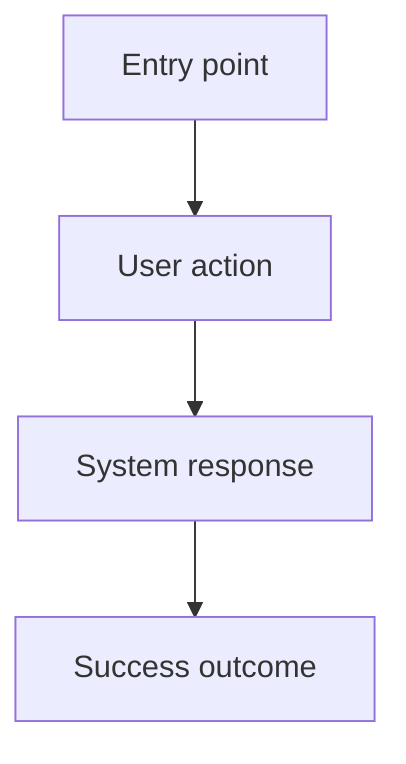

# Design: {{feature_or_product_name}}

## Summary

Describe the user-facing experience and the outcome this design supports.

## Users and Context

- Primary users:
- Usage context:
- Devices or surfaces:

## UX Goals

- 

## Visual Direction

- Design style:
- Brand personality:
- Visual hierarchy:
- Density:
- Reference or inspiration:
- Existing design system or UI library:

## Design System Baseline

Use this section as the local source of truth for consistent typography, spacing, color, component treatment, and responsive behavior. If the project already has design tokens or a UI system, reference them here instead of inventing new ones.

### Typography

| Role | Font / Token | Size | Weight | Line Height | Usage |
| --- | --- | --- | --- | --- | --- |
| Page title |  |  |  |  |  |
| Section heading |  |  |  |  |  |
| Body |  |  |  |  |  |
| Small / helper text |  |  |  |  |  |
| Button / label |  |  |  |  |  |

Rules:

- 

### Color Tokens

| Token | Value | Usage |
| --- | --- | --- |
| Background |  |  |
| Surface |  |  |
| Border |  |  |
| Text primary |  |  |
| Text secondary |  |  |
| Accent / primary action |  |  |
| Success |  |  |
| Warning |  |  |
| Error |  |  |
| Focus ring |  |  |

Rules:

- 

### Spacing, Radius, and Elevation

| Token | Value | Usage |
| --- | --- | --- |
| Space XS |  |  |
| Space SM |  |  |
| Space MD |  |  |
| Space LG |  |  |
| Space XL |  |  |
| Radius SM |  |  |
| Radius MD |  |  |
| Shadow / elevation |  |  |

Rules:

- 

### Component Patterns

| Component / Pattern | Default | Variants | Interaction States | Notes |
| --- | --- | --- | --- | --- |
| Button |  |  |  |  |
| Input |  |  |  |  |
| Select / menu |  |  |  |  |
| Card / panel |  |  |  |  |
| Modal / drawer |  |  |  |  |
| Table / list |  |  |  |  |
| Toast / alert |  |  |  |  |

Rules:

- 

### Layout and Responsive Rules

- Content width:
- Grid or column behavior:
- Mobile layout:
- Tablet layout:
- Desktop layout:
- Navigation behavior:
- Fixed or sticky elements:

## Non-Goals

- 

## User Flow

## Screens and Surfaces

| Screen / Surface | Purpose | Key Elements |
| --- | --- | --- |
|  |  |  |

## Interface States

- Loading:
- Empty:
- Success:
- Error:
- Disabled or permission-limited:

## Interaction Notes

- Navigation:
- Inputs and validation:
- Feedback and messages:
- Responsive behavior:
- Animation and transition:
- Focus behavior:

## Accessibility

- Keyboard:
- Screen reader:
- Contrast and visual clarity:
- Motion or timing:
- Touch target size:
- Error identification:

## Data and API Dependencies

- 

## Content Notes

- 

## Implementation Guardrails

- Reuse existing tokens, components, and UI library primitives before creating new styles.
- Keep typography, spacing, radius, shadow, color, and interaction states aligned with this document.
- Do not introduce a new visual pattern unless this design document is updated first.
- Link this document from UI-facing implementation tasks.

## Risks

- 

## Open Questions

- 

## Review Checklist

- [ ] User flow matches the accepted PRD or feature scope.
- [ ] Visual direction and design system baseline are clear enough to keep UI consistent.
- [ ] Typography, color, spacing, component, and responsive rules are defined or linked to an existing system.
- [ ] Screens and interface states are clear enough for task breakdown.
- [ ] Data/API dependencies are explicit.
- [ ] Accessibility expectations are covered.
- [ ] Open questions are acceptable or assigned for follow-up.

## Next Step

After the user reviews and accepts this design, break it into frontend or product-facing implementation tasks using the task-breakdown skill. Do not implement UI until a selected task has acceptance criteria and testing expectations.
