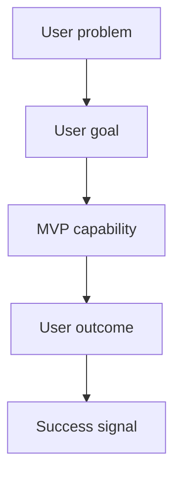

# PRD: {{product_or_feature_name}}

## Summary

Briefly describe the product or feature and the user value.

## Background

Explain the context, current problem, and why this matters.

## Target Users

- Primary:
- Secondary:

## Goals

- 

## Non-Goals

- 

## User Stories

- As a {{user}}, I want {{capability}} so that {{benefit}}.

## Product Flow

Update this chart so it shows the real user journey or product workflow. Keep it product-level; do not turn it into implementation architecture.

## Functional Requirements

| ID | Requirement | Priority |
| --- | --- | --- |
| FR-001 |  | Must |

## Non-Functional Requirements

- Performance:
- Security:
- Reliability:
- Usability:
- Maintainability:

## Acceptance Criteria

- [ ] 

## Risks

- 

## Open Questions

- 

## Review Checklist

- [ ] Scope matches the current product vision.
- [ ] MVP is small enough for the next development cycle.
- [ ] Non-goals are explicit.
- [ ] Acceptance criteria are testable.
- [ ] Open questions are acceptable or assigned for follow-up.

## Next Step

After the user reviews and accepts this PRD, generate or update `<docsRoot>/architecture/architecture.md` using the architecture-design skill. Do not break work into implementation tasks until the architecture and important ADRs are reviewed.
