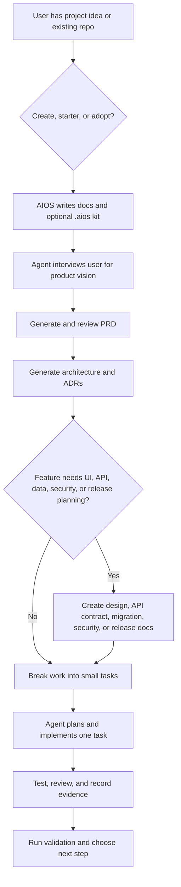

# PRD: AI-Native Development OS

## Summary

AI-Native Development OS is a reusable workflow foundation for AI-assisted software development. It packages durable project context, reusable skills, templates, references, workflows, and a helper CLI so developers can guide AI coding agents through product discovery, PRD generation, architecture, ADRs, design, task breakdown, implementation, testing, review, and release preparation.

## Background

AI coding agents are strong at local code generation, but without durable project context they can over-read, under-read, invent requirements, change unrelated files, skip tests, or produce work that is hard to review. Solo developers especially need a lightweight system that makes AI-assisted work repeatable without turning the workflow into a heavyweight platform.

AIOS addresses this by making docs and workflow assets the source of truth. A project can be created or adopted, then guided through explicit next steps using `AGENTS.md`, `.aios/config.json`, context maps, commands, prompts, skills, templates, and validation.

## Target Users

- Primary: solo fullstack developers using Codex or another AI coding agent in an IDE.
- Secondary: indie hackers, freelancers, technical founders, and maintainers of internal AI workflow kits.

## Goals

- Provide a reusable AI-native workflow that can be installed into new or existing projects.
- Keep AI agents grounded in explicit project docs and small verifiable tasks.
- Support full and lite modes so users can choose between a self-contained `.aios/` kit and a lighter docs-only setup.
- Support project shapes: fullstack, frontend, backend, mobile, library, and docs/planning only.
- Provide native skill delivery for supported agents while preserving portable Markdown fallback.
- Provide CLI helpers for setup, template generation, validation, integration rules, and next-step guidance.
- Keep the CLI small and deterministic; implementation work remains the responsibility of the AI agent and human reviewer.

## Non-Goals

- Generate production application code.
- Replace AI coding agents or run them automatically.
- Choose a user's application framework, database, cloud provider, or dependency stack.
- Apply database migrations, deploy applications, or publish releases automatically.
- Hide architecture, security, dependency, or release decisions from human review.
- Force every project to include frontend and backend folders.

## User Stories

- As a solo developer, I want to initialize a new AI-ready project so that I can start with a consistent workflow instead of rewriting prompts.
- As a maintainer, I want to adopt AIOS into an existing repository without overwriting my files so that I can improve AI workflow safety incrementally.
- As a beginner user, I want the agent to interview me before PRD generation so that I do not need to know how to write a product vision from scratch.
- As a developer, I want `aios next` to tell me the next recommended step so that I do not get lost after generating an artifact.
- As a project owner, I want validation to reflect my selected project shape so that docs-only projects do not require app folders.
- As an AI agent user, I want skills and templates installed locally or natively so that the agent can follow consistent procedures.

## Product Flow

## Functional Requirements

| ID | Requirement | Priority |
| --- | --- | --- |
| FR-001 | The CLI must create new AI-ready projects from the project skeleton. | Must |
| FR-002 | The CLI must adopt AIOS into an existing project without overwriting existing files. | Must |
| FR-003 | The CLI must support full and lite modes. | Must |
| FR-004 | The CLI must support configurable docs root through `.aios/config.json`. | Must |
| FR-005 | The CLI must support project shapes: fullstack, frontend, backend, mobile, library, and docs. | Must |
| FR-006 | Shape selection must control placeholder folders and validation requirements. | Must |
| FR-007 | Full mode must install or repair the local `.aios/` workflow kit. | Must |
| FR-008 | Native skill delivery must install selected skills for supported agents. | Must |
| FR-009 | Incomplete native skill folders must be repaired instead of skipped. | Must |
| FR-010 | `aios prompt list/show` must expose portable command prompts for agents without native command support. | Must |
| FR-011 | `aios create` must generate feature, design, OpenAPI, migration, security, ADR, task, review, and release stubs. | Must |
| FR-012 | `aios next` must recommend the next workflow step based on project docs. | Must |
| FR-013 | Optional RTK/Caveman integrations must write local rules and provide clear install guidance. | Should |
| FR-014 | Windows must avoid unsafe or unsupported external auto-install flows. | Should |
| FR-015 | Generated/adopted agent instruction files must preserve existing user instructions below the AIOS managed section. | Must |

## Non-Functional Requirements

- Performance: CLI operations should be filesystem-local and fast enough for interactive setup.
- Security: no secrets are stored; external integration installers require explicit user intent and platform-aware safety.
- Reliability: tests must cover core setup, adoption, validation, native skill installation, integrations, and package build behavior.
- Usability: user-facing CLI choices must describe their effect clearly, especially project shape and setup mode.
- Maintainability: workflow assets remain Markdown-first, framework-agnostic, and small enough for humans and agents to review.

## Acceptance Criteria

- [ ] `aios init`, `starter`, and `adopt` create or update AI-ready projects without destructive overwrites.
- [ ] `projectShape: docs` does not require or leave empty app placeholder folders after adopt.
- [ ] `aios validate` passes for generated/adopted projects that satisfy their selected mode and shape.
- [ ] Full mode installs `.aios/config.json`, commands, prompts, references, templates, workflows, integrations, and selected skill delivery.
- [ ] Native Codex skill install creates `SKILL.md` and `agents/openai.yaml`.
- [ ] `aios next` guides the user from vision discovery to PRD, architecture, design/task creation, and task execution.
- [ ] `npm test`, `npm run build`, and `npm pack` succeed on Windows.

## Risks

- The workflow may become too broad if every possible AI development practice is added to V1/V2.
- Users may accidentally adopt into a subproject if they run the wizard from the wrong directory.
- Native agent folder conventions may change across tools.
- Optional integrations may create confusion when external tools are not installed.
- Documentation can drift from CLI behavior if tests and validation do not cover the written workflow.

## Open Questions

- Should AIOS warn when adopting into a likely subproject such as `cli/`?
- Should `aios validate` offer automatic repair suggestions for optional V2.x docs?
- Should future package releases include a formal changelog gate before `npm publish`?
- Should docs-only shape be the recommended default for workflow-kit repositories?

## Review Checklist

- [ ] Scope matches the current product vision.
- [ ] MVP is small enough for the next development cycle.
- [ ] Non-goals are explicit.
- [ ] Acceptance criteria are testable.
- [ ] Open questions are acceptable or assigned for follow-up.

## Next Step

Review this PRD, then keep `docs/architecture/architecture.md` and ADRs aligned with the accepted scope. New implementation tasks should link back to this PRD when they change CLI behavior, workflow assets, skeleton behavior, or validation rules.
